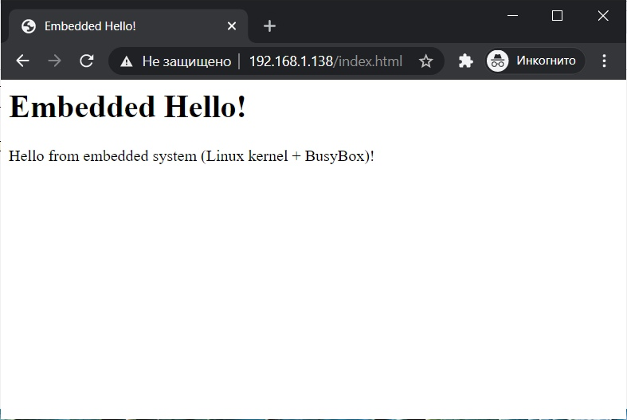

# Отчеты по лабораторным работам
####  Третий этап стажировки
##### Выполнил: Петрушин Никита Сергеевич

------------

### Лабораторная работа №2. Сборка тулчейна для кросс-компиляции с помощью системы сборки Buildroot

Во время выполнения работы была произведена конфигурация системы сборки Buildroot. В нашем случае - это конфигурация для микрокомпьютера Orange Pi Zero:

`make orangepi_zero_defconfig`

И собран сам тулчейн:

`make toolchain`

**Важно!** Для успешной сборки необходимо установить ряд дополнительных пакетов (см. руководство программисту).

Собранный тулчейн располагается в следующей директории:

*./buildroot-2020.02.10/output/host/bin*

Далее можно выполнить компиляцию простейшей программы:

`./arm-buildroot-linux-uclibcgnueabihf-gcc ~/hello.c -o ~/hello`

С помощью команды file можно посмотреть параметры файла:

`file ./hello`

> ./hello: ELF 32-bit LSB executable, ARM, EABI5 version 1 (SYSV), dynamically linked, interpreter /lib/ld-uClibc.so.0, not stripped

Это исполняемый файл формата ELF для архитектуры ARM. Кросс-компиляция выполнена успешно.


### Лабораторная работа №3. Кросс-компиляция программ с использованием готового тулчейна

Конфигурация и сборка GNU Hello прошла без каких-либо проблем с помощью команд:

`CC=arm-linux-gnueabihf-gcc LDFLAGS="-static" ./configure --host=arm-linux-gnueabihf` и `make`.

**Важно!** Для успешной сборки необходимо установить ряд дополнительных пакетов (см. руководство программисту).

С компиляцией же GNU Nano возникло много трудостей. В основном с библиотекой ncurses. Самостоятельная сборка этой библиотеки успехом не увенчалась. К счастью, получилось найти уже готовую библиотеку в интернете.

Дальше трудности не закончились: компиляция без использования разделяемых библиотек завершалась ошибкой:
> collect2: error: ld returned 1 exit status

Однако компиляция с параметром компоновщика «-static» проходила успешно. К сожалению, эту ошибку мне исправить не удалось, поэтому работу с утилитами readelf и strip я выполнял с программой GNU Hello, так как она скомпилировалась как с использованием разделяемых библиотек, так и без их использования.

Посмотреть информацию о скомпилированных файлах можно с помощью команды:

`readelf -a hello`

Размер файла без использования разделяемых библиотек - 582,1 kB

Удаление неиспользуемых частей исполняемого файла происходит с помощью команды strip. Ее можно найти в тулчейне. 

`/usr/bin/arm-linux-gnueabihf-strip hello`

Размер после strip - 389,2 kB

Размер файла с использованием разделяемых библиотек - 126,3 kB

Оптимизация при сборке включается добавлением флага компилятора:

`CFLAGS="-Os"`

Размер файла после оптимизации - 30,8 kB

Вывод запущенной программы на OrangePi:

> user@orangepizero:~$ ./hello
Hello, world!

### Лабораторная работа №4. Изучение загрузчика U-Boot

**Важно!** Для успешной сборки необходимо установить ряд дополнительных пакетов (см. руководство программисту).

Скачав исходный код загрузчика U-Boot можно приступить к сборке.

```bash
export PATH=$PATH:/home/vm/buildroot-2020.02.10/output/host/bin
make CROSS_COMPILE=arm-buildroot-linux-uclibcgnueabihf- orangepi_zero_defconfig
make CROSS_COMPILE=arm-buildroot-linux-uclibcgnueabihf- 
```

Подключив картридер к виртуальной машине с Linux, можно начать подготовку карты к записи. 
Сначала необходимо размонтировать разделы.

`sudo umount /dev/sdb1`

Посмотреть список таблиц разделов можно с помощью команды:

`sudo fdisk -l`

Далее, с помощью утилиты fdisk необходимо создать разделы. 

`sudo fdisk /dev/sdb`

> Welcome to fdisk (util-linux 2.34).
Changes will remain in memory only, until you decide to write them.
Be careful before using the write command.

> Command (m for help): d
Selected partition 1
Partition 1 has been deleted.

> Command (m for help): d
No partition is defined yet!

> Command (m for help): n
Partition type
   p   primary (0 primary, 0 extended, 4 free)
   e   extended (container for logical partitions)
Select (default p): p
Partition number (1-4, default 1): 1
First sector (2048-15333375, default 2048): 
Last sector, +/-sectors or +/-size{K,M,G,T,P} (2048-15333375, default 15333375): +75M

> Created a new partition 1 of type 'Linux' and of size 75 MiB.

> Command (m for help): n
Partition type
   p   primary (1 primary, 0 extended, 3 free)
   e   extended (container for logical partitions)
Select (default p): 

> Using default response p.
Partition number (2-4, default 2): 
First sector (155648-15333375, default 155648): 
Last sector, +/-sectors or +/-size{K,M,G,T,P} (155648-15333375, default 15333375): 

> Created a new partition 2 of type 'Linux' and of size 7,2 GiB.

> Command (m for help): w
The partition table has been altered.
Calling ioctl() to re-read partition table.
Syncing disks.

Теперь их нужно отформатировать:

`sudo mkfs.vfat /dev/sdb1`

`sudo mkfs.ext4 /dev/sdb2`

Теперь первый мегабайт карты памяти заполним нулями:

`sudo dd if=/dev/zero of=/dev/sdb bs=1k count=1023 seek=1`

А после 8 килобайт запишем файл  u-boot-sunxi-with-spl.bin следующей командой:

`sudo dd if=/home/vm/u-boot-2021.01/u-boot-sunxi-with-spl.bin of=/dev/sdb bs=1024 seek=8`

Копируем файлы (про получение файлов zImage и sun8i-h2-plus-orangepi-zero.dtb можно прочитать в руководстве программисту):

```bash
sudo mkdir /mnt/card1 /mnt/card2
sudo mount /dev/sdb1 /mnt/card1
sudo mount /dev/sdb2 /mnt/card2

sudo cp /home/vm/buildroot-2020.02.10/output/images/zImage /home/vm/buildroot-2020.02.10/output/images/sun8i-h2-plus-orangepi-zero.dtb /mnt/card1

sudo cp -r /home/vm/buildroot-2020.02.10/output/target/* /mnt/card2/
```

Дальше необходимо создать загрузочный скрипт:

> vm@virtualbox:~$ cat > boot.cmd
setenv bootargs console=ttyS0,115200 root=/dev/mmcblk0p2 rootwait panic=10
load mmc 0:1 0x43000000 sun8i-h2-plus-orangepi-zero.dtb
load mmc 0:1 0x42000000 zImage
bootz 0x42000000 - 0x43000000

`mkimage -C none -A arm -T script -d boot.cmd boot.scr`

Получившийся в результате файл boot.scr нужно скопировать на первый раздел карты
памяти:

`cp boot.scr /mnt/card1/`

Теперь можно вставить карту в компьютер и проверить работоспособность системы.

В конце можно размонтировать ненужные разделы:

```bash
sudo umount /mnt/card1
sudo umount /mnt/card2
```

### Лабораторная работа №5. Компиляция ядра Linux

Разархивировать исходный код ядра можно следующей командой:

`tar -xvf linux-5.4.96.tar.xz linux-5.4.96/`

Следующая команда выполняет стандартную конфигурацию для микропроцессора Allwinner:

`make CROSS_COMPILE=arm-buildroot-linux-uclibcgnueabihf- ARCH=arm sunxi_defconfig`

**Важно!** Перед этим необходимо добавить в переменную окружения PATH путь к кросс-компилятору.

Через *menuconfig* необходимо изменить некоторые параметры конфигурации ядра. Это можно сделать, выбрав необходимый элемент и нажав **пробел** или **Y**.

Собрать ядро можно командой:

`make CROSS_COMPILE=arm-buildroot-linux-uclibcgnueabihf- ARCH=arm`

После этого, скопировав **zImage** на карту и вставив в OrangePi, можно убедиться в работоспособности ядра.

### Лабораторная работа №6. Компиляция программы BusyBox

 ```bash
 make defconfig
 make
 ```

|  № п/п  | Режим конфигурации программы Busybox  | Размер файла busybox_unstripped  | Размер файла busybox  |
| ------------ | ------------ | ------------ | ------------ |
| 1 |  make defconfig  | 1.2 MB | 1 MB  |
| 2 |  make allnoconfig | 88 KB | 71 KB |
| 3 | make menuconfig с выбором основных команд для работы с файлами и процессами  | 150 KB  | 119 KB  |


`make CONFIG_PREFIX=/home/vm/bb_defconfig_inst/ install`

Содержание директории bb_defconfig_inst:

> vm@virtualbox:~/busybox-1.32.1$ ls -R  ~/bb_defconfig_inst/
/home/vm/bb_defconfig_inst/:
bin  linuxrc  sbin  usr

> /home/vm/bb_defconfig_inst/bin:
arch     chgrp   cttyhack       dumpkmap  fdflush  gzip      kbd_mode  login     mknod       mt       ping           reformime  run-parts     sh     tar     vi
ash      chmod   date           echo      fgrep    hostname  kill      ls        mktemp      mv       ping6          resume     scriptreplay  sleep  touch   watch
base64   chown   dd             ed        fsync    hush      link      lsattr    more        netstat  pipe_progress  rev        sed           stat   true    zcat
busybox  conspy  df             egrep     getopt   ionice    linux32   lzop      mount       nice     printenv       rm         setarch       stty   umount
cat      cp      dmesg          false     grep     iostat    linux64   makemime  mountpoint  nuke     ps             rmdir      setpriv       su     uname
chattr   cpio    dnsdomainname  fatattr   gunzip   ipcalc    ln        mkdir     mpstat      pidof    pwd            rpm        setserial     sync   usleep

> /home/vm/bb_defconfig_inst/sbin:
acpid     bootchartd  findfs       getty     ifdown     ip       iprule    losetup   mke2fs      modinfo     raidautorun  runlevel           swapoff      tc       watchdog
adjtimex  depmod      freeramdisk  halt      ifenslave  ipaddr   iptunnel  lsmod     mkfs.ext2   modprobe    reboot       setconsole         swapon       tunctl   zcip
arp       devmem      fsck         hdparm    ifup       iplink   klogd     makedevs  mkfs.minix  nameif      rmmod        slattach           switch_root  udhcpc
blkid     fbsplash    fsck.minix   hwclock   init       ipneigh  loadkmap  mdev      mkfs.vfat   pivot_root  route        start-stop-daemon  sysctl       uevent
blockdev  fdisk       fstrim       ifconfig  insmod     iproute  logread   mkdosfs   mkswap      poweroff    run-init     sulogin            syslogd      vconfig

> /home/vm/bb_defconfig_inst/usr:
bin  sbin

> /home/vm/bb_defconfig_inst/usr/bin:
'['           chpst     deallocvt    envuidgid   ftpput    ipcs      lsusb      nmeter     pkill      rpm2cpio      sha256sum    strings   test          ttysize    uptime     who
'[['          chrt      diff         expand      fuser     killall   lzcat      nohup      pmap       runsv         sha3sum      sum       tftp          udhcpc6    users      whoami
 awk          chvt      dirname      expr        groups    last      lzma       nproc      printf     runsvdir      sha512sum    sv        time          udpsvd     uudecode   whois
 basename     cksum     dos2unix     factor      hd        less      man        nsenter    pscan      rx            showkey      svc       timeout       unexpand   uuencode   xargs
 bc           clear     dpkg         fallocate   head      logger    md5sum     nslookup   pstree     script        shred        svok      top           uniq       vlock      xxd
 beep         cmp       dpkg-deb     fgconsole   hexdump   logname   mesg       od         pwdx       seq           shuf         tac       tr            unix2dos   volname    xz
 blkdiscard   comm      du           find        hexedit   lpq       microcom   openvt     readlink   setfattr      smemcap      tail      traceroute    unlink     w          xzcat
 bunzip2      crontab   dumpleases   flock       hostid    lpr       mkfifo     passwd     realpath   setkeycodes   softlimit    taskset   traceroute6   unlzma     wall       yes
 bzcat        cryptpw   eject        fold        id        lsof      mkpasswd   paste      renice     setsid        sort         tcpsvd    truncate      unshare    wc
 bzip2        cut       env          free        install   lspci     nc         patch      reset      setuidgid     split        tee       ts            unxz       wget
 cal          dc        envdir       ftpget      ipcrm     lsscsi    nl         pgrep      resize     sha1sum       ssl_client   telnet    tty           unzip      which

> /home/vm/bb_defconfig_inst/usr/sbin:
addgroup   brctl     crond      dnsd        fdformat  i2cdetect  i2ctransfer  loadfont  nandwrite   partprobe   rdev          rtcwake     svlogd     ubidetach  ubirsvol
add-shell  chat      delgroup   ether-wake  fsfreeze  i2cdump    ifplugd      lpd       nbd-client  popmaildir  readahead     sendmail    telnetd    ubimkvol   ubiupdatevol
adduser    chpasswd  deluser    fakeidentd  ftpd      i2cget     inetd        mim       nologin     powertop    readprofile   setfont     tftpd      ubirename  udhcpd
arping     chroot    dhcprelay  fbset       httpd     i2cset     killall5     nanddump  ntpd        rdate       remove-shell  setlogcons  ubiattach  ubirmvol

Содержание директории bb_menuconfig_inst:

> vm@virtualbox:~/busybox-1.32.1$ ls -R  ~/bb_menuconfig_inst/
/home/vm/bb_menuconfig_inst/:
bin  usr

> /home/vm/bb_menuconfig_inst/bin:
busybox  cat  chmod  cp  kill  ln  ls  mkdir  mknod  mount  ps  pwd  rm  rmdir  sh  touch

> /home/vm/bb_menuconfig_inst/usr:
bin

> /home/vm/bb_menuconfig_inst/usr/bin:
killall  mkfifo  renice  whoami

Содержание директории bb_allnoconfig_inst:

> vm@virtualbox:~/busybox-1.32.1$ ls -R  ~/bb_allnoconfig_inst/
/home/vm/bb_allnoconfig_inst/:
bin

> /home/vm/bb_allnoconfig_inst/bin:
busybox  sh

Код разработанного апплета:

```c
/*
 * Applet example for BusyBox
 *
 * Licensed under GPLv2, see file LICENSE in this source tree.
 */

#include "libbb.h"

//config:config VSI
//config: bool "vsi"
//config: default y
//config: help
//config: Student info program.

//kbuild:lib-$(CONFIG_VSI) += vsi.o
//applet:IF_VSI(APPLET(vsi,BB_DIR_BIN,BB_SUID_DROP))

//usage:#define vsi_trivial_usage
//usage: "Student info\n"
//usage:#define vsi_full_usage
//usage: "Returns student info\n"
//usage: "\n -name for name"
//usage: "\n -city for city"
//usage: "\n -university for university"

int vsi_main(int argc, char ** argv) MAIN_EXTERNALLY_VISIBLE;
int vsi_main(int argc, char ** argv) {
  if (argc == 1) {
    printf("Petrushin Nikita\n");
    printf("Ryazan\n");
    printf("RSREU\n");
  } else {
    if (strcmp(argv[1], "-name") == 0) {
      printf("Petrushin Nikita\n");
    }
    if (strcmp(argv[1], "-city") == 0) {
      printf("Ryazan\n");
    }
    if (strcmp(argv[1], "-university") == 0) {
      printf("RSREU\n");
    }
  }
  return 0;
}
```

Вывод пользовательского апплета:

> vm@virtualbox:~/busybox-1.32.1$ ./busybox vsi
Petrushin Nikita
Ryazan
RSREU

> vm@virtualbox:~/busybox-1.32.1$ ./busybox vsi -name
Petrushin Nikita

> vm@virtualbox:~/busybox-1.32.1$ ./busybox vsi -city
Ryazan

> vm@virtualbox:~/busybox-1.32.1$ ./busybox vsi -university
RSREU

Кросскомпиляция BusyBox для микрокомпьютера OrangePi также была успешна выполнена:

> vm@virtualbox:~/busybox-1.32.1$ file busybox

> busybox: ELF 32-bit LSB executable, ARM, EABI5 version 1 (SYSV), dynamically linked, interpreter /lib/ld-uClibc.so.0, stripped

### Лабораторная работа №7. Создание встроенной с нуля на основе ядра Linux и программы BusyBox

Выполняем конфигурацию и сборку BusyBox:

```bash
make CROSS_COMPILE=arm-buildroot-linux-uclibcgnueabihf- defconfig
make CROSS_COMPILE=arm-buildroot-linux-uclibcgnueabihf- LDFLAGS=-static
make CROSS_COMPILE=arm-buildroot-linux-uclibcgnueabihf- install
```

>You will probably need to make your busybox binary
setuid root to ensure all configured applets will
work properly.

Также, судя по надписи выше, необходимо выполнить следующее:

```chmod +s /mnt/remote/bin/busybox```

Дальше я выполнял все по инструкции из методических указаний, но система не хотела запускаться: происходила паника ядра.

> Kernel panic - not syncing: No working init found.  Try passing init= option to kernel. See Linux Documentation/admin-guide/init.rst for guidance.

Также я пробовал собрать rootfs по другой [инструкции ](https://researchbd.blogspot.com/2017/04/an-attempt-to-make-minimal-busybox.html?m=1 "инструкции "), что тоже не получилось.

Эту ошибку исправить у меня никак не получилось.

Дальнейшее задание по настройке сетевой подсистемы я выполнял с rootfs от Buildroot.

**Важно!** Apache сервер (httpd) не входит в orangepi_zero_defconfig Buildroot. Его необходимо дополнительно добавить через menuconfig.

Заполнить html файл можно прямо из терминала самого OrangePi командой:

```# cat > /usr/htdocs/index.html```

Результат: 


### Лабораторная работа №8. Изучение системы сборки корневой файловой системы Buildroot

Получение и запись образа прошивки zImage через Buildroot была выполнена в ЛР №4

defconfig
Тип процессорной архитектуры целевого устройства - i386
Тип и параметры тулчейна для кросс-компиляции - Buildroot toolchain
Тип корневой файловой системы и используемый в ней тип сжатия - тип файловой системы был не опредлен, сжатие - "tar the root filesystem" 

make orangepi_zero_defconfig
Тип процессорной архитектуры целевого устройства - ARM 
Тип и параметры тулчейна для кросс-компиляции - Buildroot toolchain
Тип корневой файловой системы и используемый в ней тип сжатия - тип файловой системы - ext2/3/4 root filesystem, тип сжатия - не определен. 

В меню конфигурации ядра можно найти такие пункты, как версия ядра, выбор логотипа загрузки, тип образа ядра, формат сжатия ядра.

Так выглядит первая цель в файле Buildroot и ее зависимости:

```bash
all: world
world: target-post-image
target-post-image: $(TARGETS_ROOTFS) target-finalize staging-finalize
```

Скрипт, который должен выполняться после сборки программного обеспечения:

```bash
#!/bin/bash 

echo "My own script"
echo "Some text here" > $TARGET_DIR/somefile.txt
```

Его расположение можно указать через menuconfig в System configuration:

> (./post_build.sh) Custom scripts to run before creating filesystem images    


### Лабораторная работа №9. Создание пакетов для системы сборки корневой файловой системы Buildroot

Для добавления собственного пакета в Buildroot необходимо выполнить следующее. 

В файл package/Config.in добавить

```bash
menu "Misc"
    source "package/hello/Config.in"
endmenu
```

В package/hello/Config.in

```bash
config BR2_PACKAGE_HELLO
    bool "hello"
    depends on BR2_arm
    help
      Hello world package
      Petrushin Nikita
```

В package/hello/hello.mk


```bash
################################################################################
#
# hello
#
################################################################################

HELLO_VERSION = 1.0
HELLO_SITE = ./package/hello/src
HELLO_SITE_METHOD = local

define HELLO_BUILD_CMDS
    $(MAKE) CC="$(TARGET_CC)" LD="$(TARGET_LD)" -C $(@D)
endef

define HELLO_INSTALL_TARGET_CMDS
    $(INSTALL) -D -m 0755 $(@D)/hello $(TARGET_DIR)/usr/bin
endef

$(eval $(generic-package))
```

В package/hello/src/Makefile

```bash
CC = gcc

.PHONY: clean

hello: hello.c
    $(CC) -o '$@' '$<'

clean:
    rm hello
```
В package/hello/src/hello.c

```c
#include <stdio.h>
int main(int argc, char* argv[]){
 puts("hello");
 return 0;
}
```

Далее лишь необходимо добавить этот пакет через menuconfig.

Результат выполнения: 

```shell
# /usr/bin/hello
hello
```


bc.mk:

```bash
################################################################################
#
# bc
#
################################################################################

BC_VERSION = 1.07.1
BC_SITE = http://ftp.gnu.org/gnu/bc
BC_DEPENDENCIES = host-flex
BC_LICENSE = GPL-2.0+, LGPL-2.1+
BC_LICENSE_FILES = COPYING COPYING.LIB
BC_CONF_ENV = MAKEINFO=true

# 0001-bc-use-MAKEINFO-variable-for-docs.patch and 0004-no-gen-libmath.patch
# are patching doc/Makefile.am and Makefile.am respectively
BC_AUTORECONF = YES

$(eval $(autotools-package))

```

«Config.in» для bc:
```bash
config BR2_PACKAGE_BC
	bool "bc"
	help
	  'bc' is an arbitrary precision numeric processing language
	  Its syntax is similar to C, but differs in many substantial
	  areas. It supports interactive execution of statements. 'Bc'
	  is a utility included in the POSIX P1003.2/D11 draft standard.
	  This version does not use the historical method of having bc
	  be a compiler for the dc calculator (the POSIX document
	  doesn't specify how bc must be implemented).
	  This version has a single executable that both compiles the
	  language and runs the resulting 'byte code.' The byte code is
	  not the dc language.

	  http://www.gnu.org/software/bc

```
